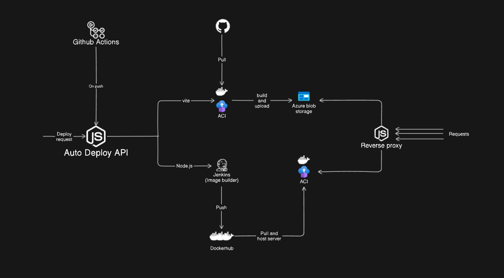

# Auto-deploy

Auto-deploy is a nifty tool designed to simplify the deployment process of Node.js and Vite projects to Azure Container instances. With just a GitHub repository URL, Auto-deploy effortlessly handles the deployment, making it a breeze for developers to showcase their projects or host them on Azure.

## Features

- **GitHub Integration**: Easily deploy your Node.js and Vite projects directly from your GitHub repository.
- **Azure Container Deployment**: Harness the power of Azure Containers for seamless hosting.
- **Automated Process**: Streamline your deployment with just a single command.

## System architecture

## Getting started

**Note:** The "Getting Started" section is currently under development and will be added soon.

If you have specific questions or would like to collaborate, feel free to contact me on
[LinkedIn](https://www.linkedin.com/in/abhinavmohanan/)
[Email](mailto:abhinavmohanan17@gmail.com)
